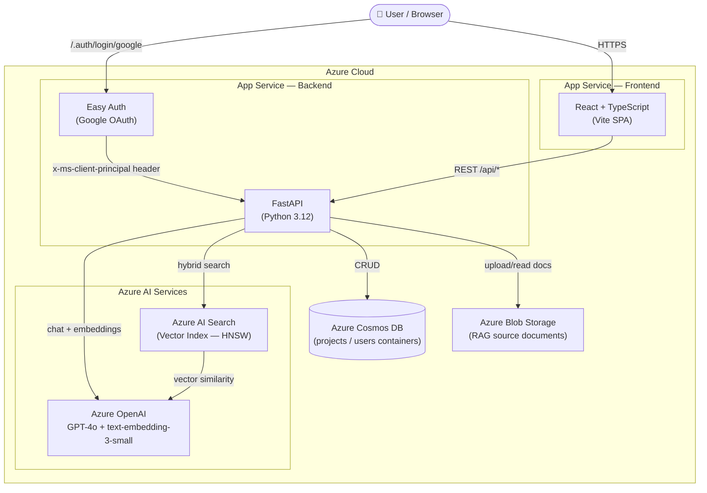
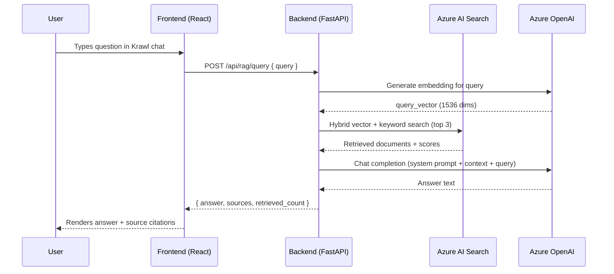

# Kurt Vonn Alde — AI-Powered Portfolio

A full-stack personal portfolio for **Kurt Vonn Alde**, Software Engineer. Beyond a static showcase, it features a AI assistant named **Krawl** powered by Retrieval-Augmented Generation (RAG) — all hosted on Azure.

---

## Features

| Feature | Description |
|---|---|
| **Home** | Profile, experience summary, skills, and social links |
| **About / AI Chat** | Krawl — a RAG-powered AI assistant that answers questions about Kurt's background, skills, and projects |
| **Sources** | Protected page for uploading and managing documents that feed the RAG index |

---

## Tech Stack

### Frontend
| Technology | Purpose |
|---|---|
| **React 19** | UI framework |
| **TypeScript** | Type safety |
| **Vite 8** | Build tool & dev server |
| **React Router v7** | Client-side routing |
| **Axios** | HTTP client |

| **React Icons / Lucide** | Icon sets |

### Backend
| Technology | Purpose |
|---|---|
| **FastAPI** | Python REST API framework |
| **Python 3.12** | Runtime |
| **Pydantic** | Data validation & models |
| **Uvicorn** | ASGI server |
| **Azure Cosmos DB SDK** | NoSQL database access |
| **Azure AI Search SDK** | Vector search / RAG retrieval |
| **Azure OpenAI SDK** | GPT-4o chat + text embeddings |
| **MSAL** | Microsoft identity library |

### Azure Cloud Services
| Service | Role |
|---|---|
| **Azure App Service** (Linux, Python) | Hosts the FastAPI backend |
| **Azure App Service** (Linux, Node) | Hosts the React/Vite frontend |
| **Azure App Service Easy Auth** | Google OAuth, session management |
| **Azure Cosmos DB** | Stores projects and user visit records |
| **Azure AI Search** | Hosts the vector index for RAG |
| **Azure OpenAI** | GPT-4o inference + `text-embedding-3-small` embeddings |
| **Azure Blob Storage** | Document storage for RAG source uploads |

---

## Architecture



### Request Flow — AI Chat (RAG)



---

## Repository Structure

```
react-ts-portfolio/
├── frontend/               # React + TypeScript (Vite)
│   └── src/
│       ├── app/            # Page components (home, about, sources)
│       ├── components/     # Shared components (Header, Footer, PortfolioChat, ProjectBoards)
│       ├── api/            # Axios clients (axiosClient, adminClient, projectsApi)
│       └── types/          # TypeScript types
│
├── backend/                # Python FastAPI
│   └── app/
│       ├── api/            # Route handlers (projects, rag, users, roles)
│       ├── auth/           # App Service auth / user context helpers
│       ├── core/           # RAG engine (rag.py) + AI Search manager (search.py) + security
│       ├── db/             # Cosmos DB client
│       └── models/         # Pydantic models
│   ├── templates/          # Markdown templates for RAG document upload
│   └── setup_rag_index.py  # Script to seed the AI Search index
│
└── docs/                   # Infrastructure & setup documentation
    ├── local-setup.md
    ├── infrastructure.md
    └── infrastructure.bicep
```

---

## Quick Start

See [docs/local-setup.md](docs/local-setup.md) for full local development setup including sample `.env` files.

## Azure Infrastructure

See [docs/infrastructure.md](docs/infrastructure.md) for the Bicep-based Azure deployment guide and resource overview.

